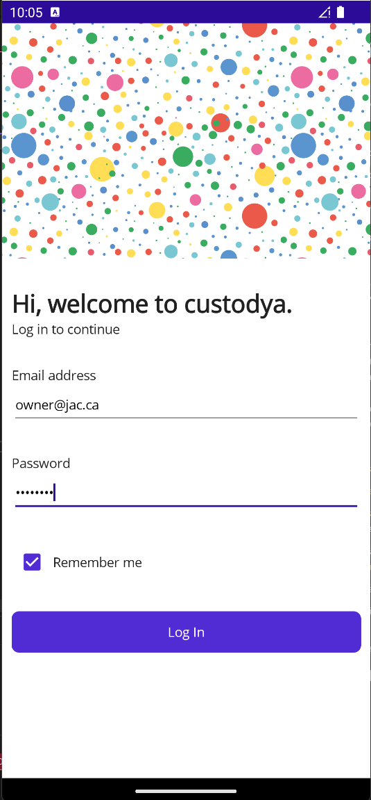
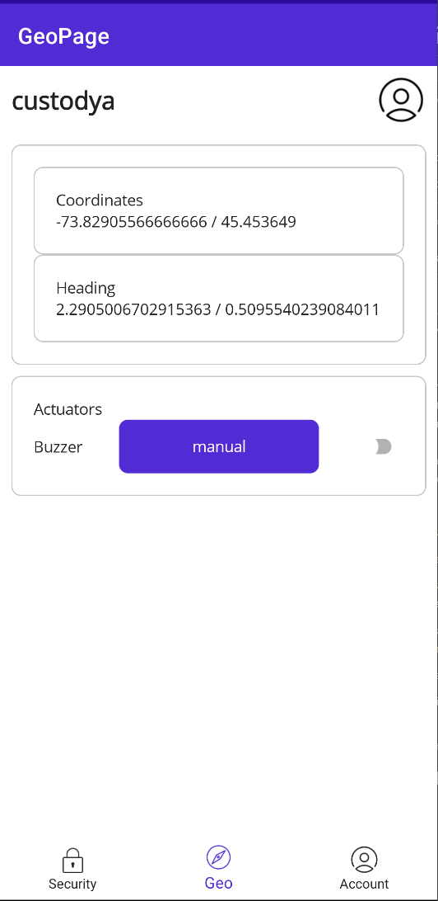
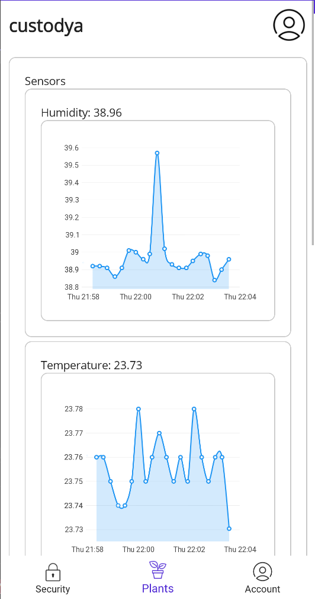
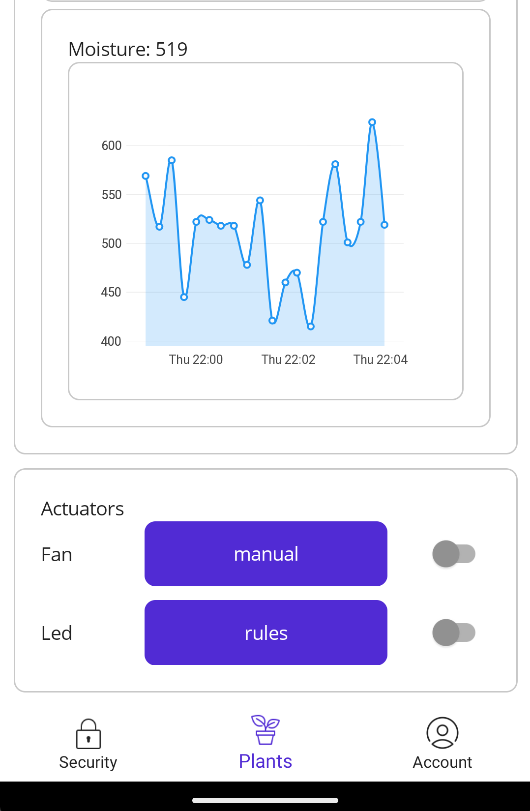
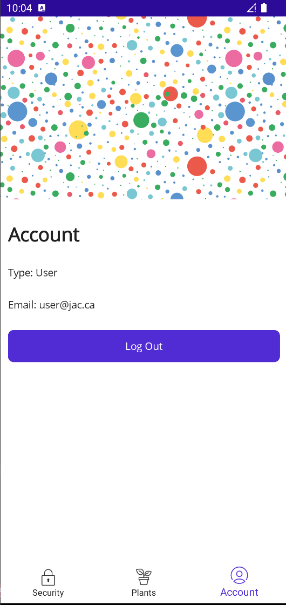
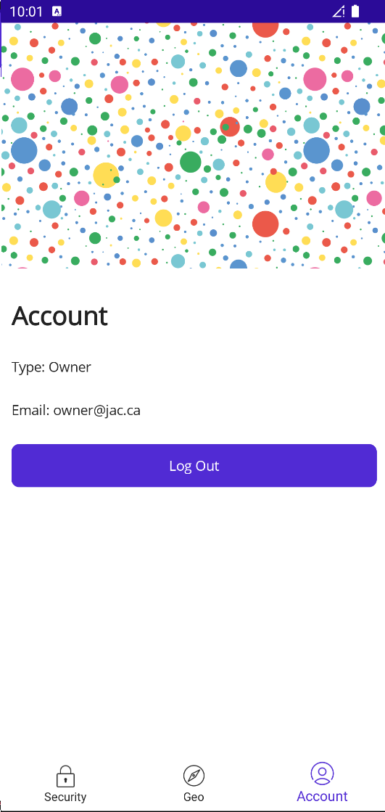

[](https://classroom.github.com/a/nUJaEIDT)
# <div align='center'>(420-6A6-AB) APP DEV III <br>(420-6P3-AB) Connected Objects <br>Winter 2023</div>

## <div align='center'>Final Project</div>
## <div align='center'>Container-Farms</div>

# Farm Device
## Project Description
The Project was created to demonstrait Sensors and Actuator Control Systems with REterminal Integration project combines sensors, actuators, and IoT technology to create a comprehensive solution for data collection and control. Sensors placed in the environment capture real-time data, which is transmitted to an IoT hub via the REterminal. The IoT hub serves as a central repository, providing storage, processing, and analysis capabilities. Applications can access the hub to retrieve sensor data and issue control commands for the connected actuators, enabling real-time monitoring, automation, and optimization in various domains such as smart homes and industrial settings. This project offers seamless communication between sensors, actuators, and applications, facilitating data-driven decision-making and efficient automation.

## Connection ports
### Actuators
| Device                                                                                                                                         | Connection Method | Grove Hat Port | Subsystem   |
| ---------------------------------------------------------------------------------------------------------------------------------------------- | ----------------- | -------------- | ----------- |
| [Buzzer](https://wiki.seeedstudio.com/reTerminal-hardware-interfaces-usage/#buzzer)                                                            | On board device   | N/A            | Geolocation |
| [Fan](https://abra-electronics.com/thermal-management/fans/dc-fans-5v/5v-cooling-fan-40mm-x-10mm.html)                                         | GPIO Digital      | D5             | Plants      |
| [RGB LED Stick (10 LEDS)](https://wiki.seeedstudio.com/Grove-RGB_LED_Stick-10-WS2813_Mini)                                                     | GPIO              | D18            | Plants      |
| [Servo motor (Door lock)](https://abra-electronics.com/electromechanical/motors/servo-motors/mg90s-metal-gear-micro-servo-rc-micro-servo.html) | GPIO              | D16            | Security    |
### Sensors
| Device                                                                                                        | Connection Method | Grove Hat Port | Subsystem   |
| :------------------------------------------------------------------------------------------------------------ | ----------------- | -------------- | ----------- |
| [GPS](https://wiki.seeedstudio.com/Grove-GPS-Air530/)                                                         | UART Serial       | UART           | Geolocation |
| [Accelerometer(Pitch/Roll)](https://wiki.seeedstudio.com/reTerminal-hardware-interfaces-usage/#accelerometer) | On board device   | N/A            | Geolocation |
| [AH20 Temp+Humidity sensor](https://media.digikey.com/pdf/Data%20Sheets/Seeed%20Technology/101990644_Web.pdf) | I2C(0x38)         | D26            | Plants      |
| [Water Level Sensor](https://www.waveshare.com/wiki/Liquid_Level_Sensor)                                      | ADC               | A6             | Plants      |
| [Moisture Sensor](https://wiki.seeedstudio.com/Grove-Capacitive_Moisture_Sensor-Corrosion-Resistant/)         | ADC               | A4             | Plants      |
| [Motion Sensor](https://wiki.seeedstudio.com/Grove-Adjustable_PIR_Motion_Sensor/)                             | GPIO              | D22            | Security    |
| [Loudness Sensor](https://wiki.seeedstudio.com/Grove-Loudness_Sensor/)                                        | ADC               | A0             | Security    |
## Controling Actuators
#### Method
For all actuators, we are using **Device Twins**. Using device twins gives us an easy way to ensure our control is persistent in many situations, making it the best choice. By using Device Twins, we can ensure any commands or changes we make will still apply, even if the device is tempoarily offline for whatever reason. However, if somehow we request a change, and wish to be sure it has been applied, we can check the reported properties from the device, which in our implementation, is a 1:1 of the desired properties.
### Schema
We implemented two methods of control for actuators. Those being **manual control** and **rules**. That being said, generally we follow a structure for each actuator and rule that looks like so:
```json
{
    "actuatorControl":{
        "actuatorName":{
            "controlMethod": "manual | rules",//how we are controlling the actuator.
            "manualState": value, //if we are in manual control mode, this is the only value that matters. It decides what we will set the value to.
            "rules" :
            [
                {
                    "targetReadingType": "reading-name", //The reading type (sensor name) that you want to get the value from
                    "targetValue": value, //could be a object for geolocation, bool, float, etc. Just has to match reading type, be comparable, and parseable.
                    "comparisonType": "> OR < OR ==", //Will compare the reading value to the target value with this. I.E. using > would lead to reading > targetValue
                    "valueOnRule": "value" //If this condition is met, apply this value to the actuator.
                }, 
                {...} //you can have as many rules as youd like per actuator!
            ]
        }
    }
}
```
Using this system, you can ensure any conditionals will apply even if the app is closed.
### Manual Control
Manual control is very simple, from the actuator schema, only three values are important.
```json
"actuatorName": {
    "controlMethod": "manual",
    "manualState": value
}
```
**`"actuatorName"`**: The name of the actuator we are controlling (synonymous with the names found in both telemetry, and the reported properties.) This is the key that holds the object per actuator, so **make sure you are setting the key, not value.**

**`"controlMethod"`**: How we are controlling the actuator. If using manual control, always ensure its set to `"manual"`

**`"manualState"`**: The state we want to enter. Whatever is passed here will be served to the actuator as a command. This can be anything, but for all currently implemented actuators, it should be `true` or `false` 

Examples on manual control for ever actuator can be found __[Here](#manual-control-examples)__

### Rules 
The rules system allows you to set up conditons with results based on certain sensor outputs, it allows for more complex, automatic behavior to occur without an app connection, and at a much faster rate without causing network traffic or ratelimits.
```json
{
    "actuatorControl":{
        "actuatorName":{
            "controlMethod": "rules",
            "manualState": value,
            "rules" :[/*list of rules objects*/]
        }
    }
}
```
**`"actuatorName"`**: The name of the actuator we are controlling (synonymous with the names found in both telemetry, and the reported properties.) This is the key that holds the object per actuator, so **make sure you are setting the key, not value.**

**`"controlMethod"`**: How we are controlling the actuator. If using rules control, always ensure its set to `"rules"`

**`"manualState"`**: When using `"rules"` behavior, the behavior of `"manualState"` is altered slightly. That being, in the reported property, `"manualState"` will reflect the **current state** of the actuator, regardless of how it reached that state.
#### Rule Object
The `"rules"` array consist of as many rules as youd like, following this schema:
```json
{
    "targetReadingType": "ReadingType",
    "targetValue": value,
    "comparisonType": ">"/*OR */"<"/*OR*/"==",
    "valueOnRule": value
},
```
**`"targetReadingType"`**: This is the sensor you wish to target, this is automatic with any sensors available to the system. Currently the implemented sensors that can be used are 

- `"Vibration"` (float)
- `"Motion"` (bool) **ONLY WITH `"=="`** 
- `"Loudness"`(float)
- `"Moisture"`(float)
- `"Humidity"`(float)
- `"Temperature"`(float)
- `"Water"`(float)
- `"Coordinates"`(dict) **UNTESTED**
- `"Heading"` (dict) **UNTESTED**

**`"targetValue"`**: This is the "testing" value. It is the other value that will be used for the comparison. **ENSURE IT MATCHES THE TYPE OF THE SENSOR READING**

**`"comparisonType"`**: The comparison to perform. The result of this comparison between the two values will determine if the rule's value is applied. The comparisons available are

- `">"` = `readingValues > targetValue` 
- `"<"` = `readingValues < targetValue` 
- `"=="` = `readingValues == targetValue` 
  
**`"valueOnRule"`**: The value we will set the actuator to if the rule comparison is true. 
### Rules Control Example
```json
"Led": {
    "controlMethod": "rules",
    "manualState": false,
    "rules": [
        {
            "targetReadingType": "Loudness",
            "targetValue": 100,
            "comparisonType": ">",
            "valueOnRule": true
        },
        {
            "targetReadingType": "Loudness",
            "targetValue": 100,
            "comparisonType": "<",
            "valueOnRule": false
        }
    ]
}
```
This rule setup would lead to the Led being turned on whenever the value of the Loudness sensor is over 100, and turned off whenever it is below 100. You could apply this rule to your IOT Device over the CLI utility with this command
```bash
az iot hub device-twin update -n {HubName} -d {DeviceName} --desired '
{"actuatorControl": {
    "Led": {
        "controlMethod": "rules",
        "manualState": false,
        "rules": [
            {
                "targetReadingType": "Loudness",
                "targetValue": 100,
                "comparisonType": ">",
                "valueOnRule": true
            },
            {
                "targetReadingType": "Loudness",
                "targetValue": 100,
                "comparisonType": "<",
                "valueOnRule": false
            }
        ]
    }
}}'
```
### Manual Control Examples 
This section contains an azure IoT CLI command for each actuator, to turn them on and off.

#### __**Fan**__
Turn fan on:
```bash
az iot hub device-twin update -n {HubName} -d {DeviceName} --desired '
{"actuatorControl": {
    "Fan": {
        "controlMethod": "manual",
        "manualState": true,
        "rules": []
    }
}}'
```
Turn fan off:
```bash
az iot hub device-twin update -n {HubName} -d {DeviceName} --desired '
{"actuatorControl": {
    "Fan": {
        "controlMethod": "manual",
        "manualState": false,
        "rules": []
    }
}}'
```
#### __**Led**__
Turn lights on:
```bash
az iot hub device-twin update -n {HubName} -d {DeviceName} --desired '
{"actuatorControl": {
    "Led": {
        "controlMethod": "manual",
        "manualState": true,
        "rules": []
    }
}}'
```
Turn lights off:
```bash
az iot hub device-twin update -n {HubName} -d {DeviceName} --desired '
{"actuatorControl": {
    "Led": {
        "controlMethod": "manual",
        "manualState": false,
        "rules": []
    }
}}'
```
#### __**Buzzer**__
Turn buzzer sound on:
```bash
az iot hub device-twin update -n {HubName} -d {DeviceName} --desired '
{"actuatorControl": {
    "Buzzer": {
        "controlMethod": "manual",
        "manualState": true,
        "rules": []
    }
}}'
```
Turn buzzer sound off:
```bash
az iot hub device-twin update -n {HubName} -d {DeviceName} --desired '
{"actuatorControl": {
    "Buzzer": {
        "controlMethod": "manual",
        "manualState": false,
        "rules": []
    }
}}'
```
#### __**DoorLock**__
Lock the door:
```bash
az iot hub device-twin update -n {HubName} -d {DeviceName} --desired '
{"actuatorControl": {
    "DoorLock": {
        "controlMethod": "manual",
        "manualState": true,
        "rules": []
    }
}}'
```
Unlock the door:
```bash
az iot hub device-twin update -n {HubName} -d {DeviceName} --desired '
{"actuatorControl": {
    "DoorLock": {
        "controlMethod": "manual",
        "manualState": false,
        "rules": []
    }
}}'
```
# App Overview
This user-friendly app developed for the Project offers a visually appealing interface with charts and graphs to visualize real-time sensor data. Beyond data visualization, the app gives the users the ability to remotely control connected actuators, allowing them to control the lock, lights, the fan and more. 

## App Setup
First Create the Iot hub and get the key
1.  Log in to the Azure portal ([https://portal.azure.com](https://portal.azure.com/)) using your Azure account credentials.
2.  Once you are logged in, click on the "+ Create a resource" button in the upper-left corner of the portal.
3.  In the search bar, type "IoT Hub" and select "IoT Hub" from the search results.
4.  On the IoT Hub creation page, click the "Create" button to begin the creation process.
5.  In the "Basics" tab, configure the following settings: 
    -   Subscription: Select the desired Azure subscription.
    -   Resource Group: Choose an existing resource group or create a new one.
    -   Region: Select the region where you want the IoT hub to be located.
    -   IoT Hub Name: Provide a unique name for your IoT hub.
6.  In the "Size and Scale" tab, select the desired pricing and scaling options for your IoT hub. You can choose the desired tier, pricing and scaling options based on your requirements.
7.  Leave the remaining settings as default or modify them as needed.
8.  Finally, review the configuration settings, accept the terms and conditions, and click the "Review + Create" button.
9.  Once the validation is complete, click the "Create" button to create the IoT hub. The deployment process may take a few minutes.
10.  Once the IoT hub is successfully deployed, navigate to the created IoT hub's overview page.
11.  In the left-hand menu of the IoT hub overview page, under the "Settings" section, click on "Shared access policies."
12.  In the "Shared access policies" blade, click on the default "iothubowner" policy.
13.  In the "iothubowner" blade, you will find the "Primary Connection String" and "Primary Key" information. Either of these can be used as the hub key to connect your applications to the IoT hub.

Add the copied key to the app settings following theses steps
1.  Locate the `appsettings.json` file in your application's project directory. This file typically contains various configuration settings for your application.
    
2.  Open the `appsettings.json` file using a text editor or an integrated development environment (IDE).
    
3.  Within the `appsettings.json` file, you will find a collection of key-value pairs representing different configuration settings. Look for the key-value pair that corresponds to the Event Hub connection string. It may be named `EventHubConnectionString` or similar.
    
4.  Replace the existing value with the primary connection string or primary key obtained from the IoT hub's "Shared access policies" section in the Azure portal. The connection string should typically be in the format `Endpoint=sb://<your-namespace>.servicebus.windows.net/;SharedAccessKeyName=<your-policy-name>;SharedAccessKey=<your-policy-key>"`.

5. Replace "eventHubName" with the specific name you have chosen for your event hub. 

Next create a new consumer group make sure you don't use the default consumer group and to do this follow these steps:

2. Access the Azure portal and navigate to your IoT hub.

3. In the left-hand menu, click on "Built-in endpoints."

4. Under the "Event Hub-compatible endpoints" section, locate the "Events" endpoint and note down its name. It should be in the format sb://            <your-iothub-name>.servicebus.windows.net/<events-endpoint-name>.

5. Go back to your IoT hub's overview page, and in the left-hand menu, click on "Built-in endpoints" again.

6. Under the "Event Hub-compatible endpoints" section, click on the "Events" endpoint name you noted down earlier.

7. In the Event Hub-compatible endpoint details page, click on the "Consumer groups" tab.

8. Click on the "+ Add" button to create a new consumer group.

9. Enter a name for your new consumer group, for example, "DefaultConsumerGroup," or any other suitable name.

10. Click on the "Create" button to create the consumer group.

Next we have to create a new Storage Device:

1. Access the Azure portal at portal.azure.com.
2. In the left-hand menu, click on "Create a resource."
3. Search for "Storage account" and select the "Storage account" option from the results.
4. Click on the "Create" button to start creating a new storage account.
5. In the "Basics" tab, provide the necessary information:
6. Subscription: Select the appropriate subscription.
7. Resource group: Choose an existing resource group or create a new one.
8. Storage account name: Enter a unique name for your storage account.
9. Location: Select the desired region for your storage account.
10. Performance: Choose the performance tier (Standard or Premium) as per your requirements.
11. Account kind: Select the appropriate account kind (StorageV2 is recommended for most scenarios).
12. Replication: Choose the replication type for your storage account's data redundancy.
13. Click on the "Next: Advanced" button.
14. In the "Advanced" tab, you can specify additional settings if required. Otherwise, you can leave them as default.
15. Click on the "Next: Networking" button.
16. In the "Networking" tab, you can configure network settings if needed. Otherwise, you can leave them as default.
17. Click on the "Next: Data protection" button.
18. In the "Data protection" tab, you can enable or disable options like "Blob soft delete" and "Blob versioning" as per your requirements. Otherwise, you can leave them as default.
19. Click on the "Next: Review + Create" button.
20. Review the summary information for your storage account configuration. If everything looks correct, click on the "Create" button to create the storage account.
21. Wait for the deployment to complete. You can monitor the deployment progress on the Azure portal's notification or by navigating to the resource group where you created the storage account.
22. Once the storage account is deployed successfully, go to its overview page.
23. In the left-hand menu, under the "Settings" section, click on "Access keys."
24. Copy the "Connection string" of either "key1" or "key2" (both are equal) to use it for connecting to your storage account.

Next you need to create a new blob container:

1. Access the Azure portal at portal.azure.com.
2. In the left-hand menu, click on "Storage accounts."
3. Locate and click on the name of the storage account where you want to create the blob container.
4. In the storage account overview page, navigate to the "Blob service" section and click on "Containers."
5. In the "Containers" page, click on the "+ Container" button to create a new container.
6. Name: Enter a unique name for the blob container. The name must be lowercase and can include letters, numbers, and hyphens (-).
7. Public access level: Choose the appropriate access level for the blob container (e.g., "Private" to restrict access).
8. Click on the "OK" or "Create" button to create the blob container.

Wait for the creation process to complete. You can monitor the progress on the Azure portal or by navigating back to the storage account overview page and checking the notifications.

Next create a new device on the IotHub

1. In the left-hand menu, click on "IoT Hub."
2. Locate and click on the name of your IoT hub.
3. In the IoT hub overview page, navigate to the left-hand menu and click on "IoT devices."
4. In the IoT devices page, click on the "+ New" button to create a new device.
5. In the "Create a device" page, provide the following information:
    - Device ID: Enter a unique identifier for your new device.
    - Authentication Type: Choose "Symmetric Key" as the authentication type.
    - Auto-generate keys: Ensure this option is selected to automatically generate the device key.
6. Click on the "Save" button to create the new device.
7. Once the device is created, you will be redirected to the device details page.
8. In the device details page, locate the "Connection string—primary key" or "Connection string—secondary key" section.
9. Copy the connection string associated with either the primary or secondary key.

Make sure that the new device has these in the properties:

```Json
        "desired": {
            "telemetryInterval": 15,
            "ruleUpdateRate": 0.125,
            "reportUpdateRate": 0.125,
            "actuatorControl": {},
      }
```
Next up creating the real time firebase Database:

1. Access the Firebase console at console.firebase.google.com.
2. If you haven't already done so, create a new Firebase project by clicking on the "Add project" button or selecting an existing project.
3. Once you are in the project dashboard, click on the "Develop" menu on the left-hand side and select "Database" from the dropdown.
4. In the Database section, click on the "Create database" button.
5. Choose the "Start in test mode" option, which allows read and write access to your database rules for now. You can modify the rules later to restrict access if needed.
6. Select the location for your database. Choose the one that is closest to your target audience or meets your requirements.
7. Click on the "Next" button to proceed.
8. Now, you have successfully created a Firebase Realtime Database. You can click on the "Enable" button to start using it.

To get the firebase apikey and BaseUrl:

1. Access the Firebase console at console.firebase.google.com.
2. Select your Firebase project from the project list.
3. In the project dashboard, click on the "Project settings" gear icon located in the top-left corner of the sidebar.
4. In the project settings page, navigate to the "General" tab.
5. Under the "Your apps" section, you should see your web app listed. If you haven't added a web app yet, click on the "Add app" button and follow the instructions to add a web app.
6. Click on the configuration icon () next to your web app.
7. In the Firebase SDK snippet modal, you will find the following information:

    - Authorized Domain: The authorized domain will be listed under the authDomain property. It represents the domain that is authorized to authenticate with Firebase Authentication.

    - Base URL: The base URL will be listed under the databaseURL property. It represents the URL of your Firebase Realtime Database.

    - Firebase API Key: The Firebase API key will be listed under the apiKey property. It is a unique identifier that grants access to your Firebase project's resources.


To save connection the connection strings and API keys in the appsettings.json file using key-value pairs in the `appsettings.json` file.

In your application code, ensure that you are retrieving the connections strings from the `appsettings.json` file using the appropriate configuration reader or dependency injection mechanism.


By adding the keys to the `appsettings.json` file, your application will be able to retrieve the connections strings and establish a secure connection with the IoT hub and the database for data transmission and control. Remember to protect the `appsettings.json` file and keep the IoT hub key confidential to ensure the security of your application and IoT communications.

## App Functionality

### Initial Page: Login

The initial page of the app displays a login screen where users and owners can authenticate themselves to access the application.

### User Login
To log in as a user, follow these steps:
1. Enter your credentials in the provided login form.
2. Click on the "Login" button.
3. If the entered credentials are valid, you will be redirected to the user dashboard.


### Owner Access
Owners can access the application using the following method:
1. Enter your owner credentials in the provided login form.
2. Click on the "Login" button.
3. If the entered owner credentials are valid, you will be redirected to the owner dashboard.




Note: The login page serves as the entry point to the application and provides authentication options for both users and owners.

## Security Page (Owners)

As an owner, the security page provides you with an overview of the security status of your premises. It displays the current state of the motion detector, the door, and the level of the loudness sensor.


### Security Status

The security page presents the following information:

- **Motion Detector:** The current status of the motion detector is displayed, indicating whether motion has been detected or not. This helps you monitor any activity in the protected area.

- **Door Status:** The page shows the state of the door, indicating whether it is currently open or closed. This allows you to stay informed about the entry point's accessibility.

- **Loudness Sensor:** The level of the loudness sensor is displayed, providing information about the ambient noise level in the environment. This can help you identify unexpected or unusual sound patterns.

## Security Page (Users)

As a user, the security page provides you with an overview of the security status of your premises and allows you to take certain actions to enhance security.


### Security Status

The security page displays the following information:

- **Motion Detector:** The current status of the motion detector is shown, indicating whether motion has been detected or not. This allows you to monitor any activity in the protected area.

- **Door Status:** The state of the door is displayed, indicating whether it is currently open or closed. This helps you stay informed about the entry point's accessibility.

- **Loudness Sensor:** The level of the loudness sensor is presented, providing information about the ambient noise level in the environment. This can help you identify unexpected or unusual sound patterns.

### Door Lock Activation

As a user, you also have the ability to activate the door lock. By clicking on the Toggle button on the security page, you can securely lock the door of your premises, providing an additional layer of protection.

## Geolocation Page (Owners)

The geolocation page provides owners with a visual representation of their premises' location and allows them to monitor and control certain aspects of their property.



### Geolocation and Coordinates

The geolocation page displays the current coordinates of your premises, providing accurate information about its geographical position. This helps you easily identify the location of your property.

### Buzzer Status

The page shows the state of the buzzer, indicating whether it is currently active or inactive. This feature allows you to have an audible alert system in place and be notified of any specific events or security breaches.

### Toggle Buzzer On and Off

As an owner, you have the ability to toggle the buzzer on and off. By clicking on the "Toggle Buzzer" button on the geolocation page, you can conveniently enable or disable the buzzer based on your requirements.

## Plants Page (Users)

The Plants page provides users with essential information about the environment of their plants and allows them to control certain aspects to ensure optimal growth.






### Environment Data

The Plants page displays the following environmental parameters:

- **Humidity:** The current humidity level of the plant environment is shown, indicating the amount of moisture in the air surrounding the plants.

- **Temperature:** The current temperature of the plant environment is presented, providing information about the ambient heat conditions.

- **Moisture Level:** The page also showcases the current moisture level in the soil or substrate, indicating whether the plants have adequate water supply.

### Fan and LED Control

As a user, you have the ability to control the fan and LED lighting for your plants. This feature allows you to create an optimal growing environment by regulating air circulation and providing suitable lighting conditions.

- **Fan Control:** You can control the fan by using the provided toggle switch on the Plants page. This allows you to turn the fan on or off as required to maintain appropriate airflow.

- **LED Control:** Similarly, you can control the LED lighting for your plants using the provided toggle switch. This enables you to adjust the lighting conditions based on the specific needs of your plants.


By utilizing the Plants page, users can easily monitor the humidity, temperature, and moisture levels of their plants. Additionally, with the ability to control the fan and LED, users can create an optimal growth environment for their plants.


## Account Page

The Account page provides users with information about their account and allows them to manage their session.
    User Login: user@jac.ca 
    Password: password
    Owner Login: owner@jac.ca
    Password: password






### User Information

The Account page displays the following user information:

- **User Type:** The type of user associated with the account is shown, distinguishing between "Owner" or "User". This indicates the level of privileges and access rights for the account.

- **Email Address:** The email address associated with the account is presented, providing a unique identifier for the user.

### Logout Button

To log out of the account, users can simply click on the "Logout" button. This will terminate the current session and redirect the user to the login page.


By utilizing the Account page, users can easily view their user type, associated email address, and conveniently log out when needed.

## Future Works

Although the current version of the application provides essential functionality, there are several features that could not be implemented but may be considered for future enhancements:

1. **Notification System:** Implementing a comprehensive notification system to keep users informed about important events, alerts, or updates related to their account, security, or plant status.

2. **Transportation Notifications:** Adding the ability to receive notifications regarding transportation status, such as package delivery updates or vehicle tracking information.

3. **Pods System:** Developing a pod system for each subsystem to neatly organize the data in one view.

4. **Task Management System:** Integrating a task management system to help users organize and track their tasks or to-do lists within the application.

5. **Settings and Color Customization:** Allowing users to customize the application's settings, including the ability to change colors, themes, or personalize the user interface according to their preferences.

6. **Password Reset:** Implementing a password reset functionality to provide users with a secure and convenient way to reset their account password in case of forgetting or needing to change it.

These features represent potential future enhancements that could further improve the functionality, usability, and customization options of the application.

## Contributions

| Teammate    | Contribution                |
|-------------|-----------------------------|
| Rea Koehler        | IOT hub and rules, Fire Base,DataBase Design and parsing,device twin connection, latest farm refactor, App services, Security Sub System, all aspects of actuator rules system |
| Liam Kopke        | App front end and data binding, Charts, Plants Sub System    |
| Kevin-Christopher Laskai      |app settings, first refactor of the subsystems, Documentation , GeoLocation Sub System    |

**there were to many tasks to show them all in the table**
